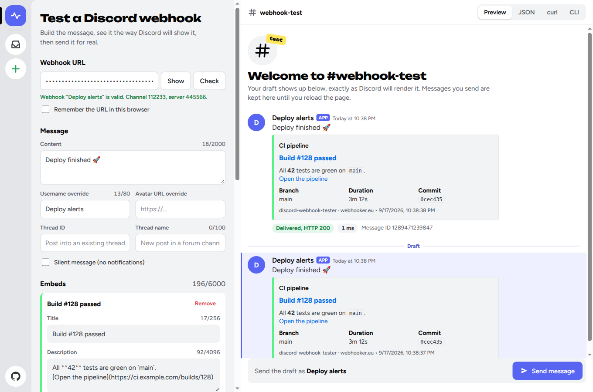

<h1 align="center">Discord Webhook Tester</h1>

<p align="center">
  A CLI and a local web form that send a test message to a Discord webhook — with a visual embed
  builder, live preview and readable explanations of Discord's errors.
</p>

<p align="center">
  <a href="https://webhooker.eu/">webhooker.eu</a> ·
  <a href="#quick-start">Quick start</a> ·
  <a href="#cli">CLI</a> ·
  <a href="#web-form">Web form</a> ·
  <a href="https://github.com/webhooker-eu">More tools</a>
</p>

<p align="center">
  <a href="https://webhooker.eu/"></a>
  
  
  
  
  
</p>

<p align="center">
  
</p>

---

## What is Discord Webhook Tester?

Discord Webhook Tester is a free, open-source tool by [Webhooker](https://webhooker.eu/) for checking
that a Discord webhook works and for designing the message it will post. Use the CLI in scripts and
CI, or start the web form to build embeds visually and copy the result as JSON, `curl` or a CLI
command.

It runs on your own machine, so the webhook URL — which is a secret — never goes to a third-party
website.

### Features

| Feature | Description |
|---|---|
| **One-command test** | `discord-webhook-tester send` posts a ready-made test embed; no options needed. |
| **Embed builder** | Title, description, color, author, fields, images, footer and timestamp — as CLI options or in the web form. Up to 10 embeds per message in the form. |
| **Live preview** | The web form looks like a Discord channel: your draft is rendered the way Discord will show it, and sent messages land in the chat with their delivery status. |
| **Export** | Copy the message as a JSON payload, a `curl` command or a CLI command. |
| **Local validation** | Discord's limits (2000 characters of content, 6000 across embeds, 25 fields and the rest) are checked before anything is sent. |
| **Readable errors** | Discord's nested error responses become lines like `embeds.0.title: Must be 256 or fewer in length.`, with a hint for common cases. |
| **Webhook check** | `info` confirms that a webhook exists and shows its name, channel and server without posting a message. |
| **Threads, forums, files** | Post into a thread, create a forum post, attach files, send silently. |
| **Script friendly** | `--json` output, meaningful exit codes, payload from a file or stdin, rate limits retried automatically. |

## Quick start

Run it without installing, using [uv](https://docs.astral.sh/uv/):

```bash
export DISCORD_WEBHOOK_URL='https://discord.com/api/webhooks/<id>/<token>'

uvx --from git+https://github.com/webhooker-eu/discord-webhook-tester discord-webhook-tester send
```

Or install it as a command:

```bash
uv tool install git+https://github.com/webhooker-eu/discord-webhook-tester
# or
pipx install git+https://github.com/webhooker-eu/discord-webhook-tester

discord-webhook-tester send
```

To get a webhook URL in Discord: **Server Settings → Integrations → Webhooks → New Webhook → Copy
Webhook URL**.

## CLI

The webhook URL is read from the `DISCORD_WEBHOOK_URL` environment variable or passed as the first
argument. Prefer the variable: command-line arguments end up in shell history.

```bash
# Default test embed
discord-webhook-tester send

# Plain text
discord-webhook-tester send --content 'Deploy finished'

# An embed
discord-webhook-tester send \
  --title 'Build #128 passed' \
  --description 'All **42** tests are green.' \
  --url 'https://ci.example.com/builds/128' \
  --color green \
  --author 'CI' \
  --field 'Branch|main|inline' \
  --field 'Duration|3m 12s|inline' \
  --footer 'ci.example.com' \
  --timestamp now

# Check the webhook without posting anything
discord-webhook-tester info

# See the JSON that would be sent
discord-webhook-tester send --title 'Hello' --color '#5865F2' --dry-run

# Send a raw payload from a file or stdin
discord-webhook-tester send --payload-file message.json
cat message.json | discord-webhook-tester send --payload-file -

# Attach files, post into a thread, skip notifications
discord-webhook-tester send --content 'Report' --file report.pdf --thread-id 1234567890 --silent
```

### `send` options

| Option | Description |
|---|---|
| `-c`, `--content TEXT` | Message text, up to 2000 characters. |
| `--username NAME` | Override the webhook's name for this message. |
| `--avatar-url URL` | Override the webhook's avatar for this message. |
| `--tts` | Send as a text-to-speech message. |
| `--silent` | Do not trigger push or desktop notifications. |
| `--thread-id ID` | Post into an existing thread. |
| `--thread-name NAME` | Create a thread with this name; required for forum and media channels. |
| `--file PATH` | Attach a file. Repeatable, up to 10. |
| `--title`, `--description`, `--url` | Embed title, description (Markdown) and the link opened by the title. |
| `--color COLOR` | `#RRGGBB`, a decimal integer, or a name: `blurple`, `green`, `yellow`, `fuchsia`, `red`, `white`, `black`. |
| `--timestamp now\|ISO8601` | Embed timestamp. |
| `--author`, `--author-url`, `--author-icon` | Embed author. |
| `--footer`, `--footer-icon` | Embed footer. |
| `--image URL`, `--thumbnail URL` | Large image and the small image in the corner. |
| `--field 'NAME\|VALUE[\|inline]'` | Embed field. Repeatable, up to 25. |
| `--payload-file PATH` | Raw JSON payload to start from; `-` reads stdin. Other options are added on top. |
| `--dry-run` | Print the JSON payload and exit without sending. |
| `--no-validate` | Skip the local checks and let Discord answer. |
| `--json` | Print the result as JSON. |
| `--timeout SECONDS` | Request timeout, 15 by default. |

### Exit codes

| Code | Meaning |
|---|---|
| `0` | The message was sent, or the webhook is valid. |
| `1` | Discord rejected the request, or it could not be reached. |
| `2` | Invalid input: a bad URL, a payload over Discord's limits, an unreadable file. |

This makes the tool usable as a health check in CI:

```bash
discord-webhook-tester info --json || echo 'The Discord webhook is broken'
```

## Web form

```bash
discord-webhook-tester serve --open      # http://127.0.0.1:8080
```

Paste the webhook URL, build the message and press **Send message**. The **JSON**, **curl** and
**CLI** tabs show the same message in a form you can paste into your code or a script.

The form keeps your draft in the browser's local storage. The webhook URL is stored only if you tick
**Remember the URL in this browser**.

### Docker

```bash
git clone https://github.com/webhooker-eu/discord-webhook-tester.git
cd discord-webhook-tester
docker compose up -d --build            # http://localhost:8080
```

Set `PORT` in a `.env` file to publish a different host port. The same image works as the CLI:

```bash
docker run --rm -e DISCORD_WEBHOOK_URL discord-webhook-tester send --content 'Hello from Docker'
```

### HTTP API

The form talks to a small JSON API; interactive docs are served at `/docs`.

| Method | Path | Body | Description |
|---|---|---|---|
| `POST` | `/api/send` | `{"webhook_url", "payload", "thread_id"?}` | Validate the payload and send it to Discord. |
| `POST` | `/api/info` | `{"webhook_url"}` | Look up the webhook. |
| `GET` | `/healthz` | | Health check. |

## Use it from Python

```python
from discord_webhook_tester import DiscordWebhookClient, build_embed, parse_color, parse_webhook_url

address = parse_webhook_url("https://discord.com/api/webhooks/<id>/<token>")
embed = build_embed(title="Hello", description="Sent from Python", color=parse_color("blurple"))

with DiscordWebhookClient() as client:
    result = client.send_message(address, {"embeds": [embed]})

print(result.ok, result.status_code, result.error)
```

## Repository layout

```
.
├── src/discord_webhook_tester/
│   ├── cli.py             # Argument parsing and terminal output
│   ├── client.py          # Webhook URL parsing, requests to Discord, error explanations
│   ├── payload.py         # Embed builder and validation against Discord's limits
│   ├── web.py             # FastAPI app behind the web form
│   └── static/            # Single-file UI (vanilla JS, no build step) and bundled fonts
├── tests/                 # pytest suite, no network access needed
├── Dockerfile             # python-slim + uv, runs as a non-root user
├── docker-compose.yml
├── pyproject.toml         # Dependencies, managed with uv
└── uv.lock
```

## Local development

### Prerequisites

- Python 3.12+ and [uv](https://docs.astral.sh/uv/)

```bash
uv sync                                       # install dependencies
uv run discord-webhook-tester send --dry-run  # run the CLI from source
uv run discord-webhook-tester serve           # http://127.0.0.1:8080
uv run pytest                                 # run the tests
```

## Security notes

- A webhook URL is a credential: anyone who has it can post to your channel. Keep it in an
  environment variable or a secret store, not in code or shell history. The CLI masks the token in
  its output, and `info` never prints it.
- The server only ever talks to Discord. Webhook URLs are parsed into an id and a token and the
  request is rebuilt from those parts, so the form cannot be used to reach other hosts.
- `serve` listens on `127.0.0.1` by default and has no authentication. If you expose it on a
  network, put it behind your reverse proxy's auth.

## About Webhooker

[Webhooker](https://webhooker.eu/) is an EU-hosted inbound webhook gateway: one ingest URL for any
provider, with signature verification, durable storage, retries and replay — so you never lose an
event. This tool is one of the free, open-source utilities we publish for people who work with
webhooks.

- Website: [webhooker.eu](https://webhooker.eu/)
- More open-source tools: [github.com/webhooker-eu](https://github.com/webhooker-eu)
- Need to inspect incoming webhooks instead of sending them? Try
  [webhook-tester](https://github.com/webhooker-eu/webhook-tester), our self-hosted request bin.

## License

[MIT](LICENSE) © [Webhooker](https://webhooker.eu/)

The web form bundles the [Unbounded](https://github.com/googlefonts/unbounded) and
[Figtree](https://github.com/erikdkennedy/figtree) typefaces under the SIL Open Font License; the
license texts are in `src/discord_webhook_tester/static/fonts/`. This project is not affiliated with
Discord.
